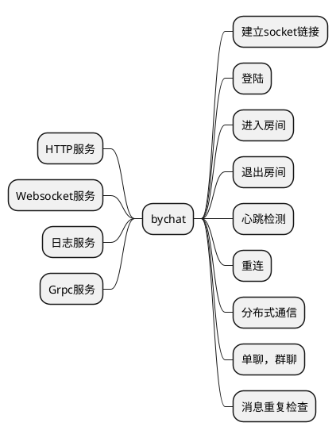

参考：https://plantuml.com/zh/mindmap-diagram

## 项目功能结构

```puml
@startmindmap
+ bychat
++ 建立socket链接
++ 登陆
++ 进入房间
++ 退出房间
++ 心跳检测
++ 重连
++ 分布式通信
++ 单聊，群聊
++ 消息重复检查
-- HTTP服务
-- Websocket服务
-- 日志服务
-- Grpc服务
@endmindmap
```
